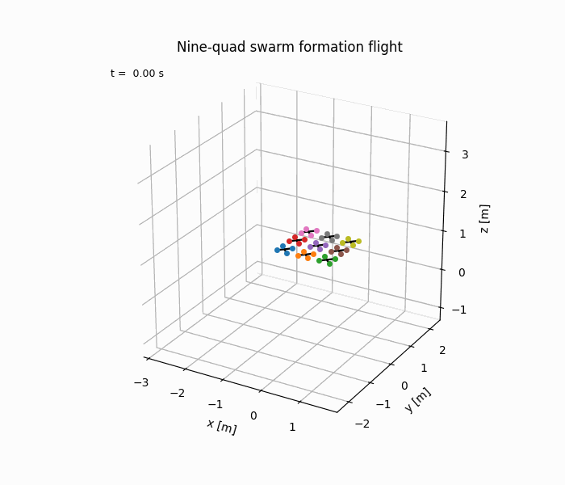
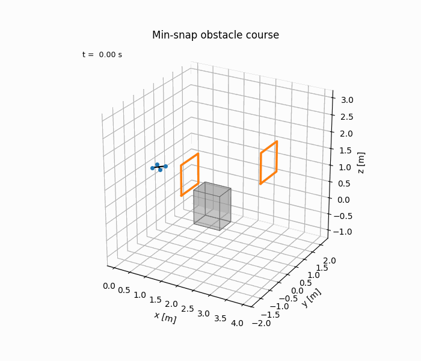
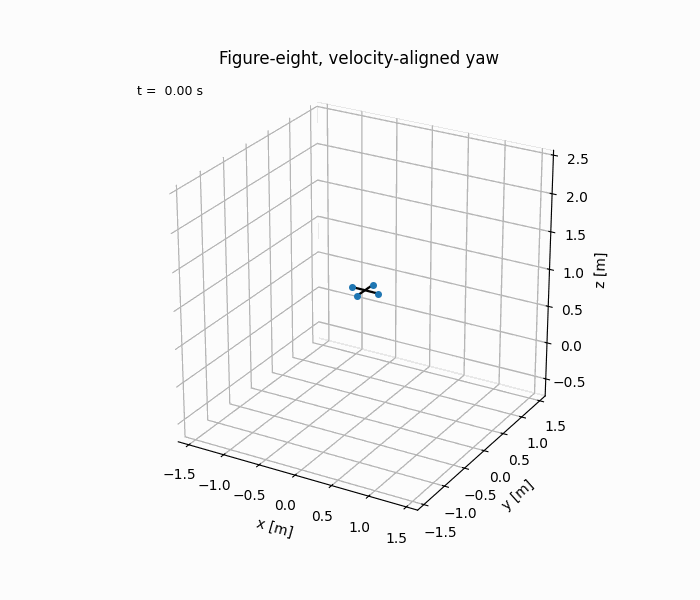

# quadsim — agile micro-quadrotor simulation

A self-contained Python simulation of agile micro-quadrotors in the style of Vijay Kumar's
GRASP Lab at UPenn, inspired by the TED talk
["Robots that fly ... and cooperate"](https://www.youtube.com/watch?v=4ErEBkj_3PY).

<p align="center">
  
  <br/>
  <em>Nine robots: grid &rarr; ring &rarr; V &rarr; circling in formation
  (formation error &lt; 0.3&nbsp;mm, from <code>demos/demo_swarm.py</code>)</em>
</p>

<p align="center">
  
  
  <br/>
  <em>Minimum-snap gate course at 4.1&nbsp;m/s peak (left) and a figure-eight with
  velocity-aligned yaw (right)</em>
</p>

Everything you see in that talk — a palm-sized quadrotor snapping through hoops, tracing
figure-eights, and nine robots morphing between formations — rests on three ideas:
minimum-snap trajectories, geometric SE(3) control, and optimal goal assignment for swarms.
This repo implements all three from scratch on top of a full rigid-body quadrotor model, with
nothing but numpy, scipy, and matplotlib. When you are ready to leave the screen, see
[`docs/HARDWARE.md`](docs/HARDWARE.md) for a sim-to-real roadmap built around the Crazyflie.

## Features

- **Full 6-DOF rigid-body dynamics** with a Crazyflie-2-like parameter set (33 g,
  thrust-to-weight ~2), quaternion attitude, X-configuration motor mixing with per-motor
  thrust saturation, and RK4 integration.
- **Minimum-snap trajectories** (Mellinger & Kumar, ICRA 2011): piecewise 7th-order
  polynomials through waypoints, solved as an equality-constrained QP in scaled time for
  numerical conditioning, with optional velocity-aligned yaw.
- **Geometric SE(3) tracking controller** (Lee, Leok & McClamroch, CDC 2010): thrust and
  attitude computed directly on the rotation group — no Euler-angle small-angle assumptions —
  with finite-difference angular-rate and angular-acceleration feedforward.
- **Swarm formation flight**: keyframed formations with smoothstep blending, optimal slot
  assignment via the Hungarian algorithm (Kumar-lab "concurrent goal assignment"), and
  pairwise collision-avoidance acceleration.
- **Visualization**: 3D flight paths with gates and box obstacles, tracking plots, and
  animated GIFs of single quads and swarms. Fully headless-capable (Agg backend).
- **Tested**: a pytest suite covering the math utilities, dynamics, trajectories,
  controller convergence, and swarm behavior.

## Quickstart

From the project root:

```bash
python3 -m venv .venv
.venv/bin/pip install -e ".[dev]"
```

Run the test suite:

```bash
.venv/bin/python -m pytest
```

Run your first flight:

```bash
.venv/bin/python demos/demo_hover.py
```

Each demo prints its metrics as `name: value` lines, ends with `PASS` (or `WARN` with a
reason), and writes its plots and GIFs into `out/`. Useful flags for every demo:

- `--fast` — shortened run (one-half to one-third length), skips the GIF (great for a first look)
- `--no-gif` — full run, but skip the (slow) GIF rendering
- `--show` — open interactive matplotlib windows instead of headless rendering
- `--out DIR` — write outputs somewhere other than `out/`

(`demos/demo_mujoco.py` renders MP4 videos rather than GIFs, so it takes `--no-video` in
place of `--no-gif`. Its interactive sibling `demos/fly_mujoco_live.py` flies the controller
live in the MuJoCo viewer with gain/speed knobs — see `docs/MUJOCO.md` for the
hyperparameter playbook and the MuJoCo-app export.)

## Demos

| Demo | What it shows | Target (from SPEC) | Outputs in `out/` |
| --- | --- | --- | --- |
| `demos/demo_hover.py` | Recovery to a hover setpoint from a 0.4 m offset, 6 s | settle to < 2 cm; steady-state RMS < 0.005 m | hover tracking plot |
| `demos/demo_minsnap.py` | Minimum-snap obstacle course threading two gates and skirting a box at 2 m/s average | RMS tracking < 0.08 m, max < 0.20 m | `minsnap_3d.png`, `minsnap_tracking.png`, `minsnap_course.gif` |
| `demos/demo_figure8.py` | Two laps of a figure-eight (~1.2 m half-width), peaking near 2.5 m/s, yaw following velocity | RMS tracking < 0.10 m | `figure8_3d.png`, `figure8_tracking.png`, `figure8.gif` |
| `demos/demo_swarm.py` | Nine robots (a nod to the talk's finale): 3x3 grid → ring → "V", then a circle lap in formation | formation RMS < 0.06 m; min pairwise distance > 0.15 m | `swarm_3d.png`, `swarm.gif` |
| `demos/demo_decentralized.py` | The nine-robot show re-flown decentralized (grid → ring → circle lap): each robot corrects only from relative positions of neighbors within a 1.2 m sensing radius, run centralized vs decentralized vs 30% sensing dropout — the variants agree to sub-millimeter | formation RMS < 0.06 m; min pairwise distance > 0.15 m | `decentralized_3d.png`, `decentralized.gif` |
| `demos/demo_mujoco.py` | Cross-engine validation: the hover and figure-eight flights re-flown inside [MuJoCo](https://mujoco.org) with the same params/controller, rendered with the 3D-printed frame mesh (needs `pip install -e ".[mujoco]"`; arm64 Python on Apple silicon — see `docs/MUJOCO.md`) | MuJoCo RMS < 0.10 m; engine-vs-engine divergence RMS < 0.08 m (measured ~0.0004 m) | `mujoco_fig8_tracking.png`, `mujoco_divergence.png`, `mujoco_fig8.mp4`, `mujoco_hover.mp4` |

The numbers above are the *targets* each demo checks itself against; run the demos to see
the actual figures on your machine.

## Theory primer

### Why small robots are agile

The talk's central scaling argument: shrink a quadrotor's linear dimension by a factor of
*r* and its mass scales like *r³* but its moment of inertia like *r⁵* (mass times length
squared). Rotor thrust scales roughly with the vehicle's cube, so the torque the rotors can
apply — thrust times arm length — scales like *r⁴*. Angular acceleration is torque over
inertia: *r⁴ / r⁵ = 1/r*. Halve the robot and you roughly **double** how fast it can flip
and reorient. That is why the machines in the video are small, and why this sim uses a 33 g
Crazyflie-class parameter set rather than a camera drone.

### Differential flatness and minimum snap

A quadrotor has 12 states but only 4 inputs, yet it is *differentially flat*: the full state
and the inputs can be recovered algebraically from the position trajectory and yaw
`(x, y, z, ψ)` and their derivatives. So trajectory planning reduces to choosing four smooth
scalar functions of time. Since the inputs depend on the 4th position derivative (snap),
Mellinger & Kumar plan by minimizing the integral of squared snap over piecewise 7th-order
polynomials — a quadratic program with waypoint and continuity constraints, solved here via
the KKT system per axis (`quadsim/trajectory.py`).

### Geometric SE(3) control

Instead of linearizing attitude with Euler angles, the Lee–Leok–McClamroch controller works
directly with the rotation matrix. From the desired force vector it builds a commanded
rotation, forms the attitude error `e_R = ½ vee(R_cmdᵀR − RᵀR_cmd)` on the group itself, and
applies PD-like feedback plus gyroscopic and feedforward terms (`quadsim/controller.py`).
The result tracks aggressive trajectories with large attitude excursions — the regime where
Euler-angle controllers fall apart.

### Swarms and goal assignment

Formations are keyframed sets of offsets from a leader reference. When the formation
changes, *which robot flies to which slot* matters: the swarm module assigns slots by
minimizing total squared travel distance with the Hungarian algorithm
(`scipy.optimize.linear_sum_assignment`), the same "concurrent goal assignment" idea used in
the Kumar lab's swarm work. Offsets blend with a C² smoothstep so the references stay smooth
enough to differentiate, and a light pairwise repulsion keeps neighbors apart in transit
(`quadsim/swarm.py`).

## Repository layout

```
quadsim/            core library
  maths.py          SO(3)/quaternion utilities (hat, vee, quat ops, rotation log)
  params.py         Crazyflie-2-like physical parameters
  dynamics.py       rigid-body dynamics, motor mixing/saturation, RK4 step
  trajectory.py     minimum-snap piecewise polynomials, flat outputs, yaw modes
  controller.py     geometric SE(3) tracking controller
  sim.py            simulation loop and History logging/metrics
  swarm.py          formation keyframes, optimal assignment, collision avoidance
  decentralized.py  decentralized formation control from relative sensing (ch08)
  viz.py            3D trajectory plots, tracking panels, GIF animation
demos/              five runnable demos (write into out/)
flight/             sim-to-hardware bridge: poly4d trajectory export, preflight checks,
                    Crazyflie flight scripts, and flight-log analysis
hardware/           parametric OpenSCAD frame (frame.scad), rendered frame.stl,
                    and the dimensioned-drawing generator (drawing.py)
docs/               design and learning documentation
  ARCHITECTURE.md   system overview, control design of record, decision log (ADRs)
  DESIGN.md         physical design of the 33 g twin: airframe, propulsion, weight budget,
                    sim-to-real deltas
  FLIGHT_TEST_PLAN.md  gated Crazyflie flight-test campaign (FT-0..FT-4) for a solo operator
  ESTIMATION.md     state estimation and sensing design for the Flow-deck platform
  HARDWARE.md       sim-to-real roadmap (Crazyflie levels 0-3)
  LEARNING.md       ECE-to-aerial-robotics learning path anchored to this codebase
  SOURCING_INDIA.md where to buy everything from Delhi/India, plus the drone rules
  course/           ten-chapter self-study course and the combined Word workbook
media/              committed copies of gitignored out/ artifacts (demo GIFs, frame drawing)
tests/              pytest suite (maths, dynamics, trajectory, controller, swarm,
                    decentralized, flight tooling)
SPEC.md             the binding interface contract the modules are written against
```

## References

- D. Mellinger and V. Kumar, "Minimum Snap Trajectory Generation and Control for
  Quadrotors," *IEEE ICRA*, 2011.
- T. Lee, M. Leok, and N. H. McClamroch, "Geometric Tracking Control of a Quadrotor UAV on
  SE(3)," *IEEE CDC*, 2010.
- A. Kushleyev, D. Mellinger, C. Powers, and V. Kumar, "Towards a Swarm of Agile Micro
  Quadrotors," *Autonomous Robots*, 2013.
- M. Turpin, N. Michael, and V. Kumar, "Trajectory Design and Control for Aggressive
  Formation Flight with Quadrotors," *Autonomous Robots*, 2012.
- V. Kumar, ["Robots that fly ... and cooperate"](https://www.youtube.com/watch?v=4ErEBkj_3PY),
  TED, 2012.

## Going real

Simulated trajectories are nice; a real 33 g robot flying them across your desk is better.
[`docs/HARDWARE.md`](docs/HARDWARE.md) lays out a staged path — from this repo, to a single
Crazyflie with a Flow deck flying these very trajectories, to Lighthouse positioning, to a
small Crazyswarm2 swarm — including a module-by-module mapping from this codebase to the
real stack, approximate prices, and safety notes.

**Binding decision (2026-08-06): the goal is autonomous flight, on a Crazyflie 2.1+ with
Flow deck v2 (Path A).** [`docs/ARCHITECTURE.md`](docs/ARCHITECTURE.md) holds the whole
picture (and the decision log); [`docs/FLIGHT_TEST_PLAN.md`](docs/FLIGHT_TEST_PLAN.md) is
the gated flight-test campaign that takes that vehicle from bench checks to a measured
speed-vs-error envelope.
