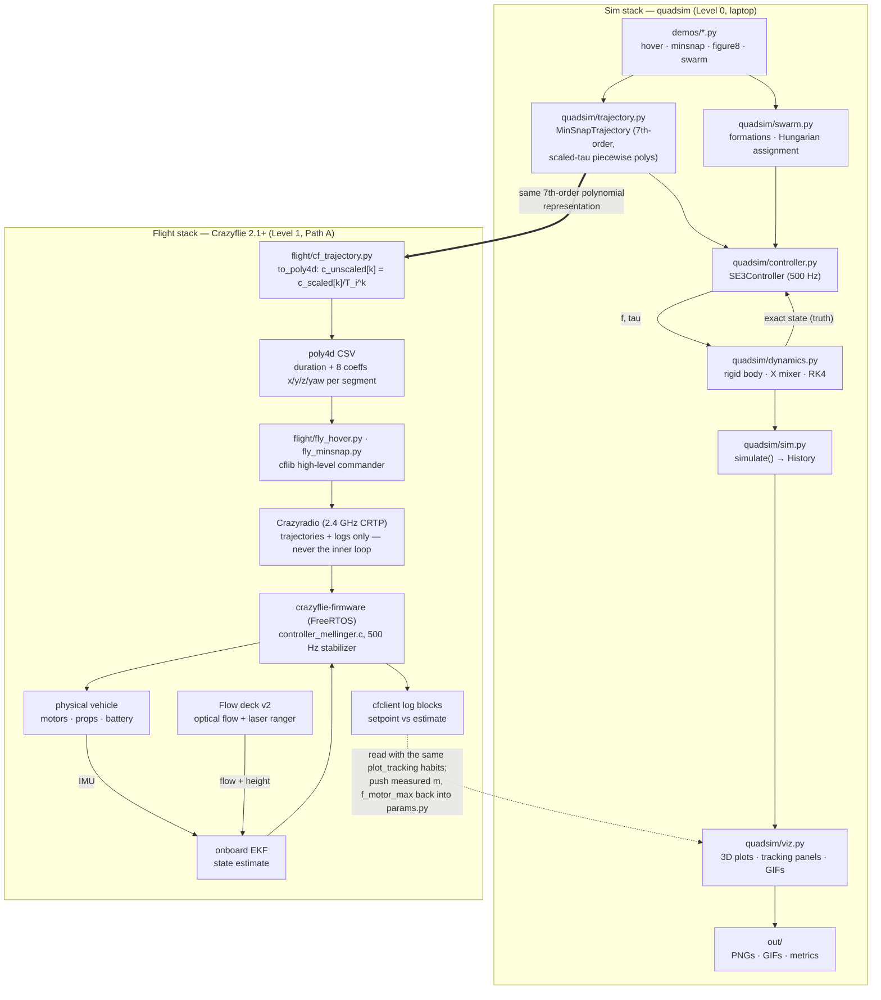

# ARCHITECTURE.md — how the whole project fits together

The single top-level engineering document for the micro-agile-robot-2026 project: one
simulator, one printable airframe, one course, one flight stack — and the contracts that
bind them. Everything quantitative here is either read from a repository file (cited
inline) or derived in front of you; nothing is invented.

**Binding decision (2026-08-06): the goal is AUTONOMOUS flight.** The flight platform is
the **Crazyflie 2.1+ with Flow deck v2 and Crazyradio** — Path A, the "Level 1" package in
[`docs/HARDWARE.md`](HARDWARE.md). The DIY 3D-printed whoop (Betaflight, manual-only)
remains a secondary mechanical-learning track: with only an IMU its position and velocity
are **not observable** ([`docs/DESIGN.md`](DESIGN.md) §9), so it can never fly the
`quadsim` trajectories autonomously. Operating context: solo operator, Delhi, India,
indoor flying, India Drone Rules 2021 nano class
([`docs/SOURCING_INDIA.md`](SOURCING_INDIA.md)).

---

## 1. System overview — two stacks, one bridge

The project is two parallel stacks built on the same mathematical objects. The **sim
stack** (Level 0) runs entirely on the laptop: minimum-snap trajectories (Mellinger &
Kumar 2011) tracked by a geometric SE(3) controller (Lee, Leok, McClamroch 2010) through
full rigid-body dynamics at 500 Hz (`dt = 0.002 s`, `quadsim/sim.py`). The **flight
stack** (Level 1) flies the *same* trajectories on a real Crazyflie: `MinSnapTrajectory`
coefficients are exported to the firmware's poly4d format, uploaded over the Crazyradio,
and tracked onboard by `controller_mellinger.c` — the firmware sibling of our
`controller.py` — closed around an EKF fed by the IMU and the Flow deck v2.

Module-by-module twinning (condensed from [`docs/HARDWARE.md`](HARDWARE.md) and
[`flight/README.md`](../flight/README.md)):

| quadsim module | Crazyflie counterpart | Nature of the twin |
| --- | --- | --- |
| `params.py` | firmware mass/inertia/thrust config | numbers, refined by system ID |
| `dynamics.py` | the physical vehicle | reality is the integrator |
| `trajectory.py` | uploaded poly4d trajectories | identical representation, one rescale rule |
| `controller.py` | `controller_mellinger.c` | same Lee-style geometric structure |
| `sim.py` / `History` | flight tests + cflib log blocks | same signal set, real data |
| `swarm.py` | Crazyswarm2 (ROS 2) — Level 3, deferred | same assignment math offline |
| `viz.py` | cfclient plotter + your own matplotlib | same reading habits |

The bridge is deliberately thin: the Crazyflie firmware's trajectory format is piecewise
7th-order polynomials in `(x, y, z, yaw)` — exactly what `MinSnapTrajectory` produces —
so the sim-to-real step is the single coefficient rescale
`c_unscaled[k] = c_scaled[k] / T_i**k` implemented in
[`flight/cf_trajectory.py`](../flight/cf_trajectory.py). Two bridge caveats
(`flight/README.md` §C.5): the flow-deck EKF's origin is wherever it powered on, so
courses must start at (0, 0, takeoff height); and although `yaw_mode="velocity"` is a
precomputed grid in `quadsim`, not a polynomial, `cf_trajectory.py` *does* export it —
a per-segment least-squares polynomial fit (per-segment fit-acceptance tolerance
5e-3 rad; round-trip verified to ≤ 0.05 rad in its smoke test) — but flights
deliberately use `yaw_mode="fixed"` per `flight/README.md` §C.5.

## 2. Control architecture

*This section is the project's control-design summary — previously this material lived
only in the course ([`docs/course/ch03-control.md`](course/ch03-control.md)); it is
consolidated here as the reference of record. Derivations and experiments remain in ch03.*

### The cascade

The controller is a classic two-loop cascade computed in one pass per 2 ms tick
(`quadsim/controller.py`, per the `SPEC.md` §controller algorithm):

1. **Outer position loop** — PD on position/velocity error plus gravity and acceleration
   feedforward: `F_des = -kp·e_p - kv·e_v + m·g·e3 + m·ref.acc`. Its outputs are a
   scalar thrust `f = max(0, F_des · R e3)` and a *commanded attitude*
   `R_cmd = flat_to_rotation(F_des, ref.yaw)`.
2. **Inner attitude loop** — PD directly on SO(3): attitude error
   `e_R = ½ vee(R_cmdᵀR − RᵀR_cmd)`, rate error `e_w`, torque
   `tau = J(−kR·e_R − kw·e_w) + w×Jw − (feedforward terms)`, with angular-rate and
   angular-acceleration feedforward obtained by finite-differencing the commanded
   rotation as a pure function of time (`fd_dt = 1e-3 s`).

Because `tau` is pre-multiplied by `J`, the attitude gains `kR`, `kw` act directly as
`ωn²` and `2ζωn` of a double integrator — the same pole-placement reading as the position
loop.

### Default gains and their pole-placement meaning

Defaults from `quadsim/controller.py` (`__init__`); derivations per ch03 §"PD control is
pole placement on a double integrator":

| Gain | Default value | Loop | ωn (rad/s) | ζ | Derivation |
| --- | --- | --- | --- | --- | --- |
| `kp` | `m·[16, 16, 16]` | position (x, y, z) | √16 = **4.0** | 1.0 | `kp/m = ωn²`; `ζ = (kv/m)/(2ωn) = 8/8` |
| `kv` | `m·[8, 8, 8]` | position damping | — | — | sets ζ above |
| `kR` | `[1000, 1000, 100]` | attitude roll/pitch | √1000 ≈ **31.6** | ≈ 1.0 | J-normalized: `kR = ωn²`; `ζ = 63/(2√1000) ≈ 1.0` |
| `kR` (z) | 100 | attitude yaw | √100 = **10** | 1.0 | `ζ = 20/(2·10) = 1.0` |
| `kw` | `[63, 63, 20]` | attitude damping | — | — | sets ζ above |

Every loop is critically damped (ζ = 1.0): no overshoot, fastest non-ringing response.
The design rule is **time-scale separation**: the roll/pitch attitude loop at 31.6 rad/s
runs **≈ 8× faster** than the 4 rad/s position loop (31.6/4 = 7.9), so within the outer
loop's band the attitude loop looks like an ideal actuator. Ch03's experiments show the
failure modes: at `kR/16` (inner ωn = 7.9 rad/s, barely 2× separation) tracking degrades
visibly, and ch07's latency experiments show ~20 ms of added loop delay makes the
32 rad/s attitude loop ring and ~40 ms makes it depart — which is exactly why the 500 Hz
inner loop lives *onboard* and the radio only carries trajectories and logs
(`flight/README.md` §C.6). Yaw is deliberately slower (10 rad/s): position tracking never
depends on yaw, and yaw authority is physically weak (`c_tau = 0.006 m` makes yaw torque
~5× weaker than roll/pitch per unit differential thrust, `docs/DESIGN.md` §9).

### Where each piece is implemented

| Piece | Sim (Level 0) | Flight (Level 1) |
| --- | --- | --- |
| Trajectory generation | `quadsim/trajectory.py` (laptop) | same — generated on the laptop, uploaded |
| Position + attitude control | `quadsim/controller.py`, gains above | firmware `controller_mellinger.c`, **firmware's own stock tune** (select via `stabilizer.controller = 2`) |
| Integral action | none — the sim's model is exact, so none is needed | `ki_*` terms in `controller_mellinger.c` absorb battery sag and trim (`flight/README.md` §C.6) |
| State | exact truth from `dynamics.py` | EKF from IMU + Flow deck v2 |
| Actuator saturation | `dynamics.mix()` clips to `f_motor_max = 0.16 N` per motor | real motors + battery sag |

The sim gains do **not** transfer numerically to the firmware — the twin relationship is
structural (same cascade, same geometric errors), and comparison happens through tracking
logs, not through copying gain values.

## 3. Document map

Every document in the repository, what it is for, and when to read it.
(`docs/course/Quadrotor_Course.docx` is generated from the chapter markdown by pandoc —
the markdown is the source of truth. `.pytest_cache/README.md` is a tool artifact, not a
project doc.)

| Document | Role | Audience / when to read |
| --- | --- | --- |
| [`README.md`](../README.md) | Front door: what quadsim is, quickstart, demo table with targets, theory primer | First contact; return for the demo-target table |
| [`SPEC.md`](../SPEC.md) | **Binding interface contract** for every `quadsim` module: names, units, frames, algorithms, test thresholds | Before touching any `quadsim/` code; the arbiter in any interface dispute |
| [`docs/ARCHITECTURE.md`](ARCHITECTURE.md) | This file: system overview, control design of record, traceability, decisions, gaps | When you need the whole-project picture or to trace a requirement |
| [`docs/DESIGN.md`](DESIGN.md) | Physical design of the 33 g printed twin: dimensions, propulsion, wiring, weight budget, sim-to-real deltas (§9) | Before building the DIY track; §9 before any real flight |
| [`docs/HARDWARE.md`](HARDWARE.md) | Sim-to-real roadmap, Levels 0–3 (Crazyflie, Flow deck, Lighthouse, Crazyswarm2), prices, safety | When deciding what to buy next; safety section is binding |
| [`docs/SOURCING_INDIA.md`](SOURCING_INDIA.md) | Where to buy everything from Delhi: Indian distributors, INR ballparks, Drone Rules 2021 context | When ordering parts |
| [`docs/LEARNING.md`](LEARNING.md) | The learning method (read–run–break–explain) and module-by-module session plan mapped to ECE background | At the start of the learning journey; the course below is its full expansion |
| [`docs/course/README.md`](course/README.md) | Course index: how to use the 10 chapters + the Word workbook | Entry point to the course |
| [`docs/course/ch00-introduction.md`](course/ch00-introduction.md) | Why small robots are agile; repo tour; running tests and demos | Course start |
| [`docs/course/ch01-rotations.md`](course/ch01-rotations.md) | Quaternions and SO(3) (`maths.py`) | Before reading any attitude code |
| [`docs/course/ch02-dynamics.md`](course/ch02-dynamics.md) | 13-state model, mixer matrix, inertia scaling (`dynamics.py`) | Before touching dynamics or the mixer |
| [`docs/course/ch03-control.md`](course/ch03-control.md) | Full derivation + experiments behind §2 of this file (`controller.py`) | Before retuning any gain |
| [`docs/course/ch04-trajectories.md`](course/ch04-trajectories.md) | Differential flatness, min-snap QP/KKT (`trajectory.py`) | Before designing courses or touching the solver |
| [`docs/course/ch05-swarms.md`](course/ch05-swarms.md) | Formations, Hungarian assignment, avoidance (`swarm.py`) | Before swarm work (Level 3 prep) |
| [`docs/course/ch06-mechanical.md`](course/ch06-mechanical.md) | Parametric CAD from `params.py`, design-for-printing (`frame.scad`) | Before editing the frame |
| [`docs/course/ch07-real-flight.md`](course/ch07-real-flight.md) | Estimation, latency, bias — quantified sim-to-real effects | Before first Crazyflie flight; referenced throughout `flight/README.md` |
| [`docs/course/ch08-decentralized-swarms.md`](course/ch08-decentralized-swarms.md) | Decentralized formation control: relative sensing, consensus, connectivity (`decentralized.py`) | Before decentralized-swarm work; honest about what stays centralized |
| [`docs/course/ch09-own-firmware.md`](course/ch09-own-firmware.md) | Roadmap for porting `controller.py` into crazyflie-firmware: extension points, C port, validation gates | Before writing any custom firmware; re-entry at FT-1.1 |
| [`docs/FLIGHT_TEST_PLAN.md`](FLIGHT_TEST_PLAN.md) | **The FT-ID authority**: gated Crazyflie flight-test campaign — every FT-x.y card, procedure, and pass/fail number | Before and during every flight session; the arbiter for any FT ID or pass bar |
| [`docs/ESTIMATION.md`](ESTIMATION.md) | State-estimation design: sensor suite, onboard EKF, operating envelope, expected (non-binding) error bands | Before first Crazyflie flight; when classifying an estimation anomaly |
| [`flight/README.md`](../flight/README.md) | Flight-code guide: Path A vs B, Betaflight checklist, Crazyflie quickstart, poly4d export pipeline | Bench sessions and every flight day |
| [`hardware/README.md`](../hardware/README.md) | Frame print/render/assembly instructions; binding table `params.py` → `frame.scad` | When printing or assembling the frame |

## 4. Flight-test ID scheme

All documents reference flight tests by **FT-\<phase\>.\<number\>**. The single
authority for FT IDs, procedures, and pass/fail numbers is
[`docs/FLIGHT_TEST_PLAN.md`](FLIGHT_TEST_PLAN.md); the registry below mirrors it.

| Phase | Scope |
| --- | --- |
| FT-0.x | Bench & ground checks (no flight; props off) |
| FT-1.x | First hovers |
| FT-2.x | Trajectory following |
| FT-3.x | Aggressive maneuvers (Level-1 characterization) |
| FT-4.x | Endurance & robustness |

Registry (procedures and full pass criteria in `docs/FLIGHT_TEST_PLAN.md` §3):

| ID | Test | Key pass criterion (summary) |
| --- | --- | --- |
| FT-0.1 | Radio link + firmware version | stable connect; firmware version recorded |
| FT-0.2 | Flow deck detection + sensor sanity | `deck.bcFlow2 = 1`; ranger/flow respond correctly |
| FT-0.3 | Battery health | resting ≥ 4.15 V after full charge; no damage |
| FT-0.4 | Estimator convergence on the pad | Kalman variances settle within 15 s |
| FT-0.5 | Attitude level on the pad | \|roll\|, \|pitch\| ≤ 2° on a flat pad |
| FT-0.6 | Emergency-stop drill (props off, `flight/estop.py`) | Ctrl-C lands; E-stop kills motors < 1 s, 3/3 |
| FT-1.1 | First hover 0.5 m / 5 s | excursion ≤ 0.10 m; alt 0.5 ± 0.10 m |
| FT-1.2 | Extended hover 30 s | total drift ≤ 0.20 m, no runaway |
| FT-1.3 | Height ladder | ≤ 0.15 m wander per rung; drift-vs-height curve |
| FT-2.1 | Straight line | RMS ≤ 0.10 m, max ≤ 0.20 m |
| FT-2.2 | Square circuit | RMS ≤ 0.10 m, max ≤ 0.20 m |
| FT-2.3 | Speed ramp | RMS ≤ 0.15 m at 1.0 m/s avg |
| FT-3.1 | Figure-8 at Level 1 reduced speed | RMS ≤ 0.15 m, max ≤ 0.30 m |
| FT-3.2 | Speed sweep to 2.0 m/s peak (characterization) | RMS ≤ 0.20 m at 2.0 m/s peak, or documented limit curve |
| FT-4.1 | Endurance to the 3.2 V line | operator-commanded landing; sag curve captured |
| FT-4.2 | Repeatability ×3 | 3/3 pass FT-2.2 bars; RMS spread ≤ 0.05 m |
| FT-4.3 | Parameter feedback into `params.py` | measured mass pushed; tests + demos re-pass |

FT-0.1 through FT-0.5 are automated by `flight/preflight.py`. FT-3 flies at Level 1 as
*characterization*: missing the bars with a stable flight plus an anomaly report still
satisfies the phase gate; the full-speed sim-envelope flight is deferred to Level 2
(Lighthouse) and carries **no FT ID**.

**DIY-track bench list (no FT IDs).** The DIY printed-whoop track's bench checks are
not part of the Crazyflie campaign and receive FT IDs only if/when that track flies:

- All-up weigh-in on the 0.01 g scale (`docs/DESIGN.md` §8 step 8; ≤ 36 g, target
  ≈ 32–33 g)
- Frame geometry & fit check — motor diagonal, adjacent spacing, prop tip gap,
  press-fit bores (`hardware/README.md` post-processing; 92 mm diagonal, tip gap
  ≥ 10 mm, motors press in by hand)
- Props-off motor map + spin-direction check (`flight/README.md` Part B §6–7; R1, R3
  CCW; R2, R4 CW)
- Failsafe / emergency-stop ground drill (`flight/README.md` Part B §9; motors stop
  ≤ ~1 s on link loss)

## 5. Requirements traceability matrix

Requirement → single source of truth → where the design realizes it → how it is verified.
"Sim verification" runs today; FT IDs run when hardware arrives.

| Requirement | Source of truth | Design artifact | Verification |
| --- | --- | --- | --- |
| All-up mass 33 g target, 36 g hard max | `quadsim/params.py` `m = 0.033` kg | `docs/DESIGN.md` §2, §6 (budget totals 32.1 g); `hardware/README.md` BOM | DIY bench weigh-in (§4 DIY list, no FT ID); the flown Crazyflie configuration is weighed and pushed into `params.m` in FT-4.3 |
| Arm length 46 mm (center → rotor axis) | `quadsim/params.py` `L = 0.046` m | `docs/DESIGN.md` §2; `hardware/frame.scad` `arm_length = 46` | `frame.scad` asserts: diagonal 92 ± 0.1 mm, adjacent spacing 65.05 ± 0.1 mm (render fails otherwise); DIY bench geometry check with calipers (§4 DIY list, no FT ID) |
| Per-motor thrust ≥ 16.5 gf (0.162 N) | `quadsim/params.py` `f_motor_max = 0.16` N (16.3 gf) + spec margin | `docs/DESIGN.md` §3 motor selection & thrust budget; `hardware/README.md` thrust check | `tests/test_dynamics.py::test_hard_saturation` (sim clip is the limit); the ≈ 43 % hover-fraction figure is derived for the DIY 7×16 propulsion (`docs/DESIGN.md` §3) and is scoped to that track — on the Crazyflie the thrust margin is *characterized*: measured hover thrust fraction recorded in FT-1.2, no preset bar |
| Thrust-to-weight ≈ 2.0 at 33 g | `params.py`: `f_max = 4×0.16 = 0.64` N vs `weight = 0.033×9.81 = 0.324` N → **1.98** | `docs/DESIGN.md` §3 (spec floor 66 gf total → T/W 2.00) | Characterized, not gated: hover thrust fraction measured and recorded in FT-1.2 (no preset bar); FT-4.1 tracks its decay with pack sag |
| Adjacent prop tip gap ≥ 10 mm | `hardware/frame.scad` `check_prop_diam = 55` with derived spacing 65.05 mm | `docs/DESIGN.md` §2 (65.05 − 55 = 10.05 mm) | `frame.scad` assert `adjacent_spacing - check_prop_diam >= 10`; DIY bench fit check (§4 DIY list, no FT ID) |
| Motor press-fit bore 7.1 mm | `hardware/frame.scad` `motor_diam = 7.0` + `motor_fit_tol = 0.1` | `hardware/README.md` post-processing §1 (7.0 mm hand-drill rescue) | OpenSCAD render `ECHO` prints 7.1 mm bore, asserts pass; DIY bench hand press-fit (§4 DIY list, no FT ID) |
| 500 Hz control rate | `SPEC.md` `simulate(..., dt=0.002)`; firmware 500 Hz stabilizer loop (`flight/README.md` Part A) | `quadsim/sim.py`; stock crazyflie-firmware | entire pytest suite and all demos run at dt = 0.002; firmware rate holds by construction (stock, unmodified) |
| Hover: settle < 2 cm, steady-state RMS < 0.005 m | `SPEC.md` demos §1; `README.md` demo table | `demos/demo_hover.py` self-check (PASS/WARN) | `tests/test_controller.py::test_hover_convergence` (error < 1 cm in 4 s); FT-1.1/FT-1.2 hovers — **note:** the 5 mm sim target is truth-state; the flow-deck flight bars are 0.10–0.20 m, so FT-1 characterizes rather than passes this number, and FT-1.3 maps wander vs height |
| Min-snap tracking RMS < 0.08 m, max < 0.20 m | `SPEC.md` demos §2; `README.md` demo table | `demos/demo_minsnap.py` self-check | `tests/test_controller.py::test_circle_tracking` (RMS < 0.08 m); FT-2.1/FT-2.2 at conservative speed (RMS ≤ 0.10 m bars), FT-2.3 speed ramp; the full-speed sim envelope is deferred to Level 2 (Lighthouse) with no FT ID |
| Figure-8 tracking RMS < 0.10 m | `SPEC.md` demos §3; `README.md` demo table | `demos/demo_figure8.py` self-check | FT-3.1 figure-8 at Level 1 reduced speed; FT-3.2 speed sweep to 2.0 m/s peak (characterization); full-speed flight deferred to Level 2 with no FT ID |
| Swarm: formation RMS < 0.06 m, min pairwise distance > 0.15 m | `SPEC.md` demos §4; `README.md` demo table | `demos/demo_swarm.py` self-check | `tests/test_swarm.py::test_short_run_formation` (error < 0.08 m, min distance > 0.12 m on the n=4 case); real-swarm verification deferred to Level 3 (no FT ID assigned yet) |

## 6. Decision log

Short ADR-style entries. All dates from `git log` — the repository was consolidated on
2026-08-06, so the founding decisions share that date.

**ADR-001 (2026-08-06) — Geometric SE(3) control over Euler-angle PID.**
The project's whole point is *agile* flight: large attitude excursions where Euler-angle
small-angle linearizations break down (gimbal lock, wrapping). The Lee–Leok–McClamroch
controller does PD directly on the rotation group, so the same law that hovers also
tracks aggressive maneuvers — and it is the same structure the Crazyflie firmware ships
as `controller_mellinger.c`, which makes the sim-to-real twin structural rather than
aspirational. Cost: harder math up front (mitigated by course ch01/ch03).

**ADR-002 (2026-08-06) — Minimum-snap polynomials over generic splines.**
The quadrotor is differentially flat and its inputs depend on the 4th position derivative
(snap), so minimizing ∫‖snap‖² directly minimizes actuator violence. Piecewise 7th-order
polynomials solved as one KKT system per axis (`quadsim/trajectory.py`) give exactly the
constraint count needed, and — decisively — the Crazyflie high-level commander consumes
piecewise 7th-order polynomials natively, making the export a rescale instead of a
re-fit (`flight/cf_trajectory.py`).

**ADR-003 (2026-08-06) — 33 g X-configuration Crazyflie class ("small is agile").**
Kumar's scaling argument: shrink by *r* and inertia falls like *r⁵* while rotor torque
falls like *r⁴*, so angular acceleration grows as 1/*r* (`README.md` theory primer).
A palm-sized vehicle is the agility-optimal — and safest — choice for a solo indoor
operator, and lands in India's nano class. Hence `params.py`'s Crazyflie-2-like set
(m = 0.033 kg, L = 0.046 m, T/W ≈ 2.0) and a printed frame bound to those numbers.

**ADR-004 (2026-08-06) — OpenSCAD code-as-CAD for the frame.**
The frame must stay numerically bound to `params.py`; a parametric text-based model
(`hardware/frame.scad`, `arm_length = 46`) makes that binding literal, diffs in git, and
enforces itself via `assert()` at render time (spacing, tip gap, ring height). Traditional
CAD (Fusion 360) is deferred to when STEP files or renders are needed
(`docs/LEARNING.md` Module 6).

**ADR-005 (2026-08-06, BINDING) — Autonomy: Crazyflie 2.1+ + Flow deck v2 (Path A) over
the DIY Betaflight whoop (Path B).**
The owner wants autonomous flight of the `quadsim` trajectories. The DIY brushed whoop
carries only an IMU, and with an IMU alone **position and velocity are unobservable**
(`docs/DESIGN.md` §9) — no amount of tuning makes that board fly a trajectory; it is
pilot-in-the-loop by physics, not by firmware choice. The Flow deck v2 adds optical flow
+ laser ranging, closing position observability onboard through the firmware EKF, with
no external infrastructure, inside a Delhi apartment. The Crazyflie also uniquely offers
the Mellinger controller, poly4d upload, scriptable `cflib` flights, and the future
Lighthouse/Crazyswarm2 growth path (`docs/HARDWARE.md` Levels 1–3). The DIY build is
retained as the secondary mechanical-learning track (printing, soldering, stick skills —
`flight/README.md` Part B), not as an autonomy platform.

## 7. Known gaps & deferred work

Honest list, in the spirit of `docs/DESIGN.md` §9:

- **Estimator-in-the-loop simulation is not implemented.** `quadsim`'s controller
  consumes exact truth state from `dynamics.py`; there is no EKF, no flow/IMU sensor
  model, and therefore no way to *predict* flow-deck wander or bias offsets in sim.
  Ch07 quantifies these effects with targeted experiments (noise, latency, bias), but a
  full estimator-in-the-loop sim is future work. Until then, FT-1.x/FT-4.2 flight logs
  are the only ground truth on estimation behavior.
- **Unmodeled physics.** Aerodynamic drag, motor spool-up lag (~30–60 ms first-order),
  battery sag (~25 % thrust loss fresh→sagged), ground effect — all absent from the sim
  (`docs/DESIGN.md` §9). Handled by margins and by pushing measured `m`, `f_motor_max`,
  `J` back into `params.py`, not by modeling. FT-4.1 exists to measure, not eliminate,
  these.
- **DIY-track wiring/power diagram deferred.** `docs/DESIGN.md` §5 has the pad-mapping
  table and polarity rules, but no drawn wiring/power schematic exists yet for the
  printed-frame build.
- **Level 2 (Lighthouse) and Level 3 (Crazyswarm2 swarm) are future.** FT-3.x flies at
  Level 1 as reduced-speed *characterization* (`docs/FLIGHT_TEST_PLAN.md` FT-3); the
  full-speed sim-envelope flights are deferred to Level 2 (Lighthouse) and carry no
  FT ID. Real-swarm verification of the swarm requirements has no FT IDs yet and needs
  the ROS 2 stack (`docs/HARDWARE.md` Levels 2–3). The decentralized-swarm *sim* gap,
  however, is now implemented: `quadsim/decentralized.py` (ch08) flies the nine-robot
  scenario on relative positions of sensed neighbors only — though slot assignment,
  plan distribution, and ground-truth relative sensing remain centralized conveniences,
  as the module docstring and ch08's honesty section say outright.
- **The firmware port is roadmapped (ch09), not done.** Ch09 maps `controller.py` onto
  `controller_mellinger.c` term by term and walks a golden-vector-validated C port
  through its laptop-side gates, but no firmware code is committed in this repo and
  nothing custom has been flashed. When it is built, the campaign re-enters at FT-1.1
  (`docs/FLIGHT_TEST_PLAN.md`) like any other engineering change.
- **Velocity-aligned yaw is exported but deliberately not flown.** `cf_trajectory.py`
  *does* export `yaw_mode="velocity"` trajectories — a per-segment least-squares
  polynomial fit (per-segment fit-acceptance tolerance 5e-3 rad; round-trip verified
  to ≤ 0.05 rad in its smoke test) — but flights use `yaw_mode="fixed"` per
  `flight/README.md` §C.5: yaw is the weakest control axis and fixed yaw sidesteps
  yaw-drift coupling. Figure-8 flights (FT-3.1/FT-3.2) therefore differ from the sim
  demo in yaw behavior by choice, not by a missing export capability.
- **No automated gain transfer.** Sim gains (§2) and firmware Mellinger gains are tuned
  independently; comparison is by tracking logs only. A principled mapping (or firmware
  gain sweep against sim predictions) is future work.
- **All prices are approximate** (2026 USD in `docs/HARDWARE.md`/`docs/DESIGN.md`, INR
  in `docs/SOURCING_INDIA.md`) — verify against live listings before ordering.
